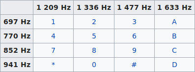

# DTMF decoder
(sorry for my english, I'm not dumb but French)

You always dreamt to find the phone number dialled by someone in a video? It's now possible! You have to record the audio of the *beeps* and this script will extract phone numbers from the dial tones.

## Installation
(If you are on Mac or Windows, go to hell.)

```
git clone https://github.com/ribt/dtmf-decoder/
cd dtmf-decoder
chmod +x dtmf.py
sudo cp dtmf.py /usr/local/bin/dtmf
```

## Usage

You have to give a wav file (you can try to convert it with `ffmpeg -i audio.mp3 audio.wav` for example).

```
Usage: dtmf [-h] [-v] [-l] [-r] [-d] [-t F] [-i T] file.wav

optional arguments:
  -h, --help     show this help message and exit
  -v, --verbose  show a complete timeline
  -l, --left     left channel only (if the sound is stereo)
  -r, --right    right channel only (if the sound is stereo)
  -d, --debug    show graphs to debug
  -t F           acceptable frequency error (in hertz, 20 by default)
  -i T           process by T seconds intervals (0.05 by default)
```

## Examples

You can test this script with these examples :
- [a perfect file without noise](https://github.com/ribt/dtmf-decoder/blob/master/perfect-example.wav?raw=true)
- [a non-perfect file with noise](https://github.com/ribt/dtmf-decoder/blob/master/not-perfect-example.wav?raw=true)

#### The perfect case

```shell
$ dtmf perfect-example.wav 
0234567891
```
As you can see it works perfectly, we have a classical French phone number.

#### The non-perfect case
```shell
$ dtmf not-perfect-example.wav 
023456678991
```
We can guess there is a problem because we have more than ten numbers. So try the verbose output :
```shell
$ dtmf -v not-perfect-example.wav 
0:00 ....................
0:01 ............00......
0:02 ...22.........33....
0:03 ...44444....55......
0:04 666.6....7777.....88
0:05 888....999.9......11
0:06 ....................
0:07 .......
```
And we can guess the number `6` and the number `9` had been split into two.

## How it works

This script is quite simple. We split the signal into frames and we analyse them one by one. We calculate a Fast Fourier Transorm to find its constituent frequencies. We find the frequencies with the bigger amplitude and we compare them with the DTMF's (dual-tone multi-frequency) frequencies.

Dual tone frequencies from Wikipedia:



Graph explaining the functioning :


